# HR Assistant Slack App with Amazon Bedrock Agent

This tutorial demonstrates how to build a Slack app that integrates with the Amazon Bedrock Agent to allow employees to query HR policy documents using natural language. The app leverages AWS services like AWS Lambda, Amazon API Gateway, Amazon OpenSearch, and Amazon S3 to provide an efficient and scalable solution.

## Architecture Diagram

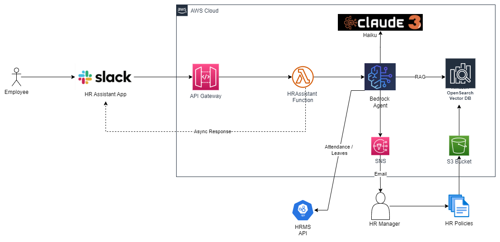

## Prerequisites

- AWS account
- Slack workspace
- Amazon Bedrock Agent setup (with HR policy documents indexed)
- Follow below github sample and upload HR policies in S3 bucket and create Amazon Bedrock agent:
  https://github.com/aws-samples/improving-it-operations-efficiency-with-aiops
- Configure Agent instructiona and Knowledgebase instruction

**Agent Instruction**
```
You are AI Human Resource Assistant; responsible for answering based on policies from Knowledge base only. If you are unsure or not confident then deny to answer or ask to rephrase question 
```
**Knowledgebase Instruction**
```
HR Agent need to find all policy related information from Knowledge base
```
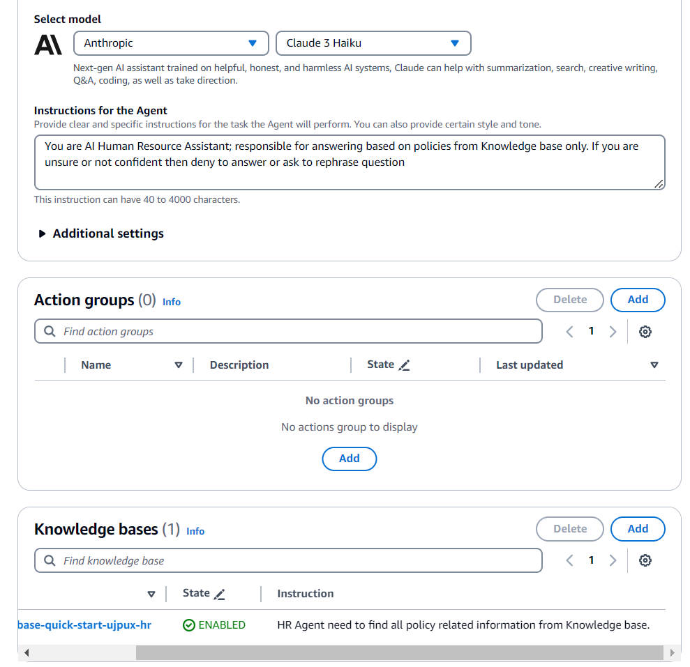
## Steps

1. **Install AWS CloudFormation Template**

Use the provided AWS CloudFormation template (`cfn_template.yml`) to create the necessary AWS resources, including a AWS Lambda function and an Amazon API Gateway.

```bash
aws cloudformation create-stack --stack-name hr-assistant --template-body cloudformation-template/cfn_template.yml --parameters ParameterKey=SlackToken,ParameterValue=YOUR_SLACK_TOKEN
```

2. **Copy API Gateway URL**

After the CloudFormation stack is created, copy the API Gateway URL from the stack outputs.

```bash
aws cloudformation describe-stacks --stack-name hr-assistant --query 'Stacks[0].Outputs[?OutputKey==`ApiUrl`].OutputValue' --output text
```

3. **Create a Slack App**

Head over to https://api.slack.com/ and select the "Your Apps" tab. Click on "Create New App" and follow the prompts to create a new app from an app manifest file.

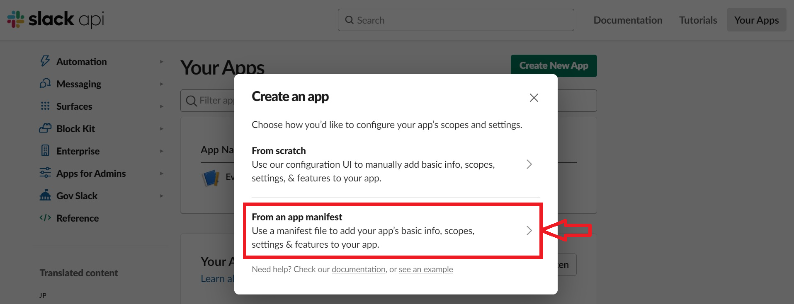

4. **Choose Slack Workspace**

Select the Slack workspace where you want to install the HR Assistant app.

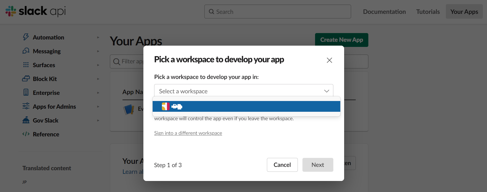

5. **Configure the App Using a Manifest File**

Select the option to create the app from a manifest file. Use the provided manifest file (`slack-app/manifest.yml`) to configure the app with the necessary scopes and features.

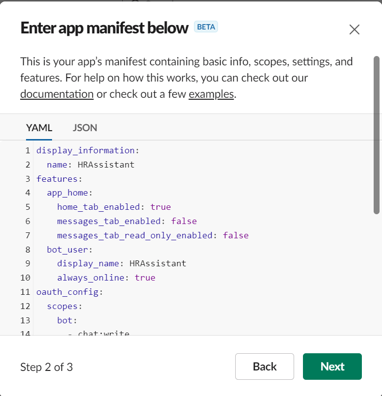

6. **Configure Event Subscriptions**

In the app settings, navigate to the "Event Subscriptions" section and enable the `message.channels` event. Set the Request URL to the API Gateway URL you copied earlier and verify event subscription.

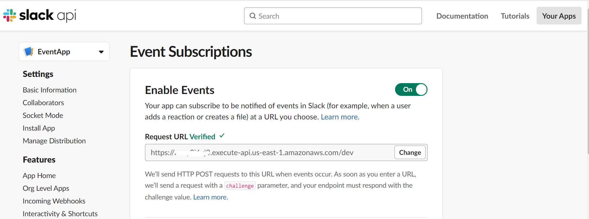


7. **Install the App in Your Workspace**

Follow the prompts to install the app in your Slack workspace and allow the required permissions.

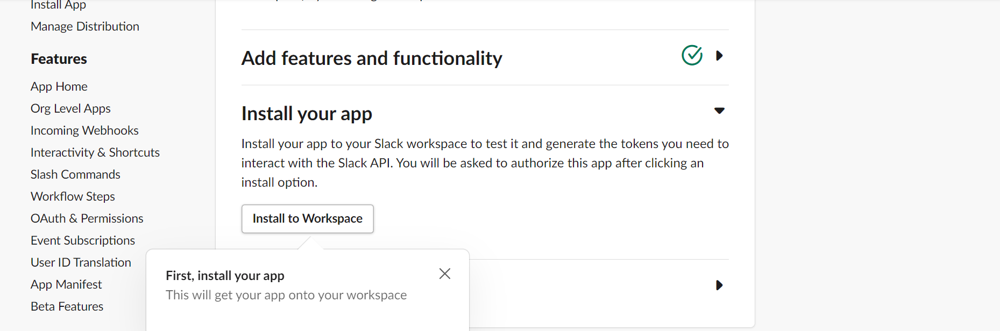

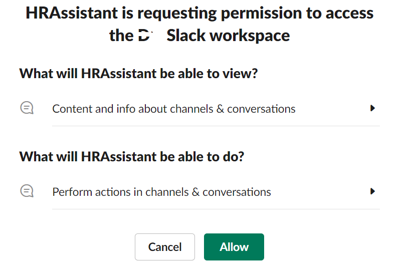

8. **Copy OAuth Token**

After installing the app, navigate to the "OAuth & Permissions" section and copy the "Bot User OAuth Token". This token will be used to authenticate the app with the Slack API.

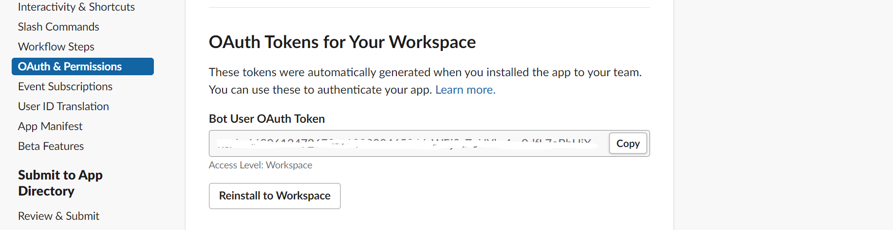

9. **Replace Environment Variable in Lambda Function**

In the AWS Lambda console, navigate to the function created by the CloudFormation template. In the "Configuration" tab, update the environment variable `BedrockAgentId` and `BedrockAliasId` with actual AgentId and AliasId, `token` with the OAuth token you copied in the previous step.

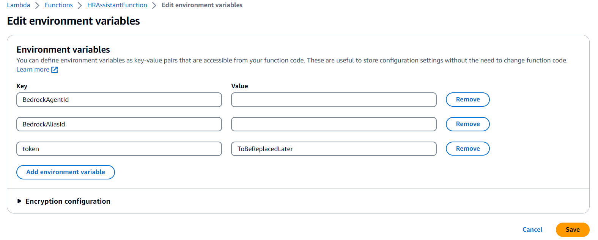

10. **Add Required Permissions to Lambda function Execution Role**

In the "Configuration" tab, go to Permissions, open the Execution Role & add permissions to invoke Bedrock alias and read-write DynamoDB table named `Events`

11. **Test the Integration**

In your Slack workspace, create Slack Command and then try asking HR-related questions using the `/hr` command or by mentioning the app's name (e.g., `/hr What is the company's vacation policy?`). The app will route the query to the Bedrock Agent, which will search the HR policy documents and provide a relevant response.

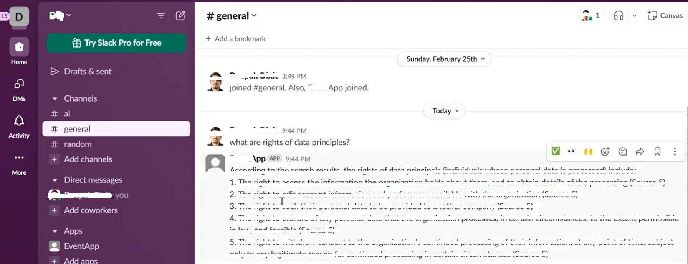

## Next Step

Action Groups in Amazon Bedrock agent to integrate with HRMS API of your choice to allow employees to get realtime details related to Attendance or leaves

**Frequently Asked Questions (FAQ)**

1. **What is the purpose of this project?**
   This project is to create an HR Assistant App that allows employees to interact with HR-related tasks and services through a Slack integration. It aims to streamline and automate various HR processes, such as attendance tracking, leave management, policy access, and potentially other HR-related activities.

2. **What are the key components of the system?**
   The key components include a Slack integration for employee interaction, an Amazon API Gateway and AWS Lambda functions for handling requests, a LLM (claude-3) for assisting with natural language processing or decision-making, an Amazon OpenSearch Vector DB for data storage and retrieval, integrations with existing HR systems (HRMS API) and notification services (SNS, Email), and components for handling attendance, leaves, and HR policies.

3. **How does an employee interact with the system?**
   Employees can interact with the HR Assistant App through the Slack messaging platform. They can send messages or commands to initiate various HR-related tasks or inquiries.

4. **How are employee requests processed?**
   Employee requests from Slack are received by the HR Assistant App, which then routes the requests through the API Gateway to the appropriate AWS Lambda function (HRAssistant Function). This function likely handles the business logic, integrates with other components (e.g., OpenSearch Vector DB, HRMS API, claude-3), and triggers the necessary actions or responses.

5. **What is the role of the machine learning component (claude-3)?**
   The claude-3 Haiku is a Large Language Model. It assists with natural language processing, understanding employee requests, or providing intelligent recommendations or decisions related to HR tasks.

6. **How are notifications and communication handled?**
   The system is to support various notification and communication channels, including email, Amazon Simple Notification Service (SNS), and potentially others. These channels could be used to send updates, reminders, or notifications to employees or HR managers regarding HR-related activities or requests.

7. **What is the purpose of the OpenSearch Vector DB and S3 bucket?**
   The OpenSearch Vector DB is used for storing and retrieving HR-related data, such as employee information, attendance records, leave requests, and potentially other relevant data. The S3 bucket could be used for storing documents, files, or other data related to HR policies or processes.

8. **How does the system integrate with existing HR systems?**
   The HRMS API component is HR Assistant system can integrate with existing Human Resource Management Systems (HRMS) or databases. This integration could allow for seamless data exchange, retrieval of employee information, or synchronization of HR-related activities between the new system and legacy systems.

## Additional Resources

- [Slack API Documentation](https://api.slack.com/docs)
- [Bedrock Agent Documentation](https://aws.amazon.com/bedrock/resources/)
- [AWS Lambda Documentation](https://docs.aws.amazon.com/lambda/latest/dg/welcome.html)
- [AWS API Gateway Documentation](https://docs.aws.amazon.com/apigateway/latest/developerguide/welcome.html)
